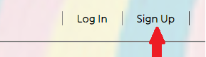
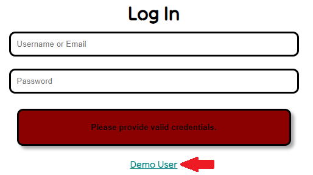
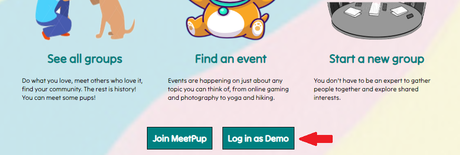

# Welcome to MeetPup!

*(ReadMe v1.2, updated 3/12/2013)*

### What is MeetPup?
- A project to emulate [Meetup](https://www.meetup.com/).
- This is a project built on express backend and react / redux frontend.

### Some planned features
- Group CRUD
- Events CRUD
- RSVP
- Join Group
- Advanced search with queries
- Calendar for individual and all group pages
- AWS/S3 Image Upload
- Google Maps 

## How to get started
1. From the root, run:
    npm run install
which will install both frontend and backend dependencies.
2. In the backend, reference .env.example and configure appropriately. As of now,
there is no validation for .env.
3. Run the appropriate migrations and seeders in the backend directory:
    npx dotenv sequelize db:migrate:all
    npx dotenv sequelize db:seed:all
4. Start both frontend and backend servers (on development, separately) with:
    npm run

## How to use MeetPup
Eventually, most of the functionalities implemented in MeetUp will be mirrored here as well. This includes creating events, groups, RSVP, etc...  
 
Sign up through the sign-up button on the top right. 
  
 
One can also access the webpage with full functionality with the demo user under login.
  
 
Alternatively, you may also click on the *Log In as Demo* button on the bottom of the page!
  
 
Enjoy!

